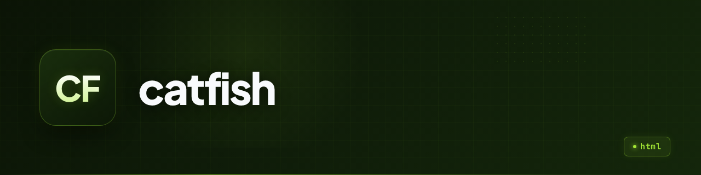

<p align="center">
  
</p>

<h1 align="center">catfish</h1>

<p align="center"><b>A phishing simulation tool that demonstrates how fake giveaway pages capture user credentials.</b></p>

<p align="center">
  
  
  
  
</p>

---

## What is it

catfish is a minimal phishing simulation built with Rust and the Rocket web framework. It serves a fake "SORTEO" (giveaway) page offering a free iPhone, presents a login form that mimics Google Sign-In, and captures any submitted credentials to a plaintext file. After submission, the user sees a fake "congratulations you won" page.

**In one sentence:** A proof-of-concept phishing page that demonstrates how credential harvesting works through fake giveaways.

## State

| | |
|---|---|
| **State** | prototype |
| **Last activity** | 2025-05 |
| **Can it be used today** | No, it is a learning exercise, not a production tool |
| **What's missing** | No input validation, no HTTPS, no persistence layer, no detection evasion, hardcoded Gmail theme |
| **Known risks / tech debt** | Credentials stored in plaintext; no rate limiting; no logging; the `credentials` file is tracked in git |

## Why it exists

This is a personal educational project demonstrating how phishing attacks work. It shows the complete flow: a convincing landing page, a credential capture mechanism, and a post-submission confirmation page. The project is intentionally simple to illustrate the core concept without unnecessary complexity.

## Demo

No demo available. The project is not deployed and should not be used against real users.

## Installation and usage

Requirements: Rust (edition 2024), Cargo

```bash
git clone https://github.com/Gonanf/catfish.git
cd catfish
cargo run
```

The server starts on `http://0.0.0.0:3000`. Navigate to the root to see the giveaway page. The `/login` endpoint serves the fake Google Sign-In form. Submitted credentials are appended to the `credentials` file.

```bash
# Example: view captured credentials
cat credentials
```

## Stack

- **Language / runtime:** Rust (Cargo, edition 2024)
- **Dependencies:** Rocket 0.5.1 (web framework)
- **Infrastructure:** None (local development only)
- **What it does NOT use and why:** No database (credentials are file-based for simplicity), no authentication middleware (the point is to capture credentials, not protect them)

## Architecture

```
index.html       →  Landing page (fake giveaway)
/login           →  Fake Google Sign-In form
POST /login      →  Captures credentials → credentials file
                 →  Redirects to phishing/index.html (fake "you won" page)
```

The server is a single Rocket instance that serves static files and handles one POST route. Credentials are appended to a plaintext file using Rust's standard library file I/O.

## Repo structure

```
src/main.rs          # Rocket server: routes, credential capture
static/index.html    # Landing page (fake iPhone giveaway)
static/login/        # Fake Google Sign-In page (cloned HTML)
static/phishing/     # Post-submission "congratulations" page
credentials          # Captured credentials (plaintext, tracked in git)
Rocket.toml          # Server config (bind 0.0.0.0:3000)
Cargo.toml           # Rust dependencies
docs/overview.md     # Auto-generated project overview
```

## Roadmap

- [ ] Add input validation and sanitization
- [ ] Implement HTTPS support
- [ ] Add rate limiting to prevent abuse
- [ ] Remove credentials from git history
- [ ] Add logging and audit trail
- [ ] Support multiple phishing themes

## Notes and decisions

- **Plaintext credentials:** The `credentials` file stores captured data in plain text. This is intentional for the prototype to keep the code minimal, but it means the file should never be committed to a public repository.
- **Hardcoded Gmail theme:** The login page is a static clone of Google's Sign-In page. This limits the tool to one theme but keeps the implementation simple.
- **No persistence layer:** Credentials are file-based rather than database-backed. This is appropriate for a proof-of-concept but would not scale.
- **Git history contains credentials:** The `credentials` file is tracked in git. This is a security issue that should be addressed before any public sharing.

## License

Private — no license file. This is a personal educational project, not open source.

---

<!-- Template rules applied:
1. No marketing adjectives. Data only.
2. No invented features. State declared honestly.
3. Commands are real and tested.
4. If the project is abandoned, the State section says so.
5. ~150 lines max.
6. English as requested.
7. Banner and icon from assets/.
8. README.en.md not needed (single-language).
-->
